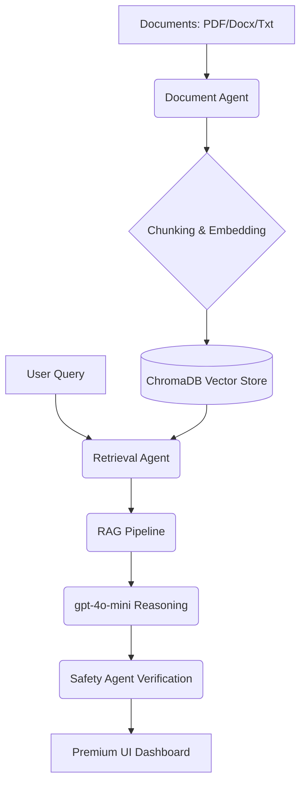

# ✨ Parsuma AI | Knowledge Intelligence Platform
> **Production-Grade Multi-Agent RAG System for Intercultural Digital Publishing**

[](https://www.python.org/downloads/)
[](https://streamlit.io/)
[](https://www.trychroma.com/)
[](https://openai.com/)
[](https://opensource.org/licenses/MIT)

---

## 📖 Overview

**Parsuma AI** is a state-of-the-art Knowledge Intelligence Platform engineered for global digital publishing organizations. It bridges the gap between institutional knowledge and intercultural content strategy through advanced **Retrieval-Augmented Generation (RAG)** and a **decentralized multi-agent architecture**.

Designed as a Master’s Level Applied AI Engineering project, the platform provides a premium, high-fidelity command center for analyzing complex document repositories and generating actionable, grounded insights for international audiences.

---

## 🌟 Core Intelligence Features

### 🧠 Advanced RAG Engine
- **Neural Semantic Retrieval**: Leveraging `all-MiniLM-L6-v2` embeddings for high-precision vector mapping.
- **Context-Aware Synthesis**: Powered by OpenAI `gpt-4o-mini` for nuanced reasoning and grounded responses.
- **Dynamic Citations**: Every insight is traced back to source document chunks with confidence scoring.

### 🤖 Multi-Agent Orchestration
- **Document Intelligence Agent**: Handles ingestion, sentence-boundary-aware chunking, and metadata tagging.
- **Content Strategy Agent**: Synthesizes knowledge into localized roadmaps for intercultural publishing.
- **Safety & Ethics Agent**: Real-time evaluation of response grounding and malicious input detection.

### 🎨 Premium User Experience
- **Glassmorphism UI**: A dark-mode, futuristic dashboard built with Streamlit and custom CSS.
- **Real-time Telemetry**: Interactive Plotly visualizations for system latency, token usage, and hallucination risks.

---

## 🏗️ Technical Architecture



---

## 🚀 Getting Started

### 🔧 Installation

1. **Clone & Navigate**:
   ```bash
   git clone <your-repo-url>
   cd parsuma-ai-platform
   ```

2. **Environment Setup**:
   Create a `.env` file from the provided example:
   ```bash
   cp .env.example .env
   ```
   Edit `.env` and add your `OPENAI_API_KEY`.

3. **Dependency Management**:
   ```bash
   pip install -r requirements.txt
   ```

4. **Launch Platform**:
   ```bash
   streamlit run app.py
   ```

### 🐳 Docker Quickstart
```bash
docker build -t parsuma-ai .
docker run -p 8501:8501 --env-file .env parsuma-ai
```

---

## 🛡️ Safety & Responsible AI
Parsuma AI implements a **Zero-Trust Hallucination Policy**:
- **Grounding Score**: Every response is evaluated against retrieved context to ensure factual alignment.
- **Input Sanitization**: Built-in protection against prompt injection and adversarial queries.
- **Observability**: Complete audit logs of agent reasoning and retrieval paths.

---

## 🧪 Quality Assurance
The platform includes a comprehensive test suite covering retrieval accuracy, prompt integrity, and pipeline robustness.
```bash
pytest tests/
```

---

## 📝 License
This project is licensed under the MIT License - see the [LICENSE](LICENSE) file for details.

---
**Developed for the Xamk Master’s Program in Applied AI Engineering.**
