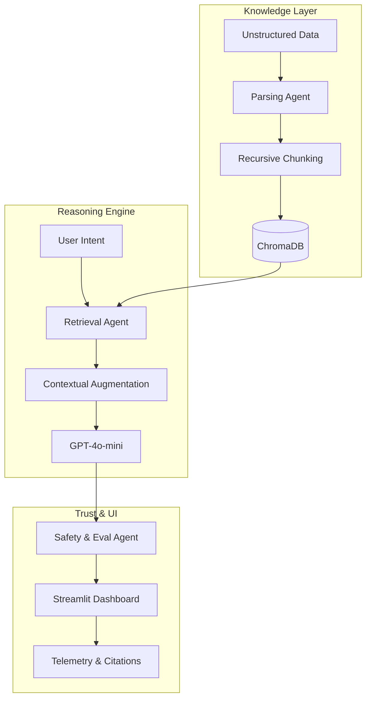

# 🌌 Parsuma AI | Knowledge Intelligence Platform
> **A Master’s Level Multi-Agent RAG System for Intercultural Digital Publishing**

[](https://www.python.org/)
[](https://streamlit.io/)
[](https://openai.com/)
[](https://www.trychroma.com/)
[](https://www.docker.com/)
[](https://opensource.org/licenses/MIT)

---

## 📋 Project Overview

**Parsuma AI** is a production-grade Knowledge Intelligence platform engineered as a **Final Project for the Master’s Program in Applied AI Engineering**. 

The platform addresses the complex challenge of **Intercultural Digital Publishing** by providing an intelligent orchestration layer between unstructured institutional knowledge and global content strategy. By leveraging state-of-the-art **Retrieval-Augmented Generation (RAG)**, Parsuma AI enables organizations to transform vast document repositories into actionable, localized, and culturally sensitive publishing roadmaps.

---

## 🌟 Core Features & AI Agent Capabilities

### ⚡ Neural Intelligence & Retrieval
- **Advanced Semantic Search**: High-dimensional vector mapping using `text-embedding-3-small`.
- **Dynamic RAG Pipeline**: Real-time context injection with citation tracking and metadata persistence.
- **Multi-Format Ingestion**: Professional-grade parsing for PDF, DOCX, and TXT with recursive character-boundary awareness.

### 🤖 Multi-Agent Architecture
The system is built on a decentralized federated agentic framework:
- **Document Intelligence Agent**: Automates extraction, cleaning, and vectorization of institutional assets.
- **Retrieval Specialist**: Optimizes similarity search queries using Cosine Similarity metrics.
- **Strategy Studio Agent**: Synthesizes intercultural content strategies and localized publishing roadmaps.
- **Safety & Evaluation Agent**: Monitors outputs for grounding, safety, and hallucination risks using faithfulness scoring.

### 🎨 Premium User Experience
- **Futuristic SaaS Interface**: A dark-mode dashboard with custom glassmorphism aesthetics and HSL color tailoring.
- **Live Telemetry**: Real-time tracking of retrieval confidence, response latency, and token consumption.
- **Agentic Workflow**: Integrated 6-page navigation from knowledge ingestion to strategic evaluation.

---

## 🏗️ Technical Architecture

Detailed architecture documentation can be found in [docs/architecture.md](docs/architecture.md).



---

## 🚀 Installation & Deployment

### 1. Prerequisites
- Python 3.10 or higher
- Docker (Optional for containerized deployment)
- OpenAI API Key

### 2. Local Setup
```bash
# Clone the repository
git clone https://github.com/animusehsan-sketch/parsuma-ai-platform.git
cd parsuma-ai-platform

# Install dependencies
pip install -r requirements.txt
```

### 3. Environment Configuration
Create a `.env` file in the root directory:
```bash
OPENAI_API_KEY=sk-your-key-here
CHROMA_DB_PATH=./chroma_db
MODEL_NAME=gpt-4o-mini
```

### 4. Run Application
```bash
streamlit run app.py
```

### 5. Docker Deployment
```bash
docker build -t parsuma-ai .
docker run -p 8501:8501 --env-file .env parsuma-ai
```

---

## 📂 Project Structure

```text
parsuma-ai-platform/
├── app.py              # Main Entry Point (Streamlit Dashboard)
├── src/                # Core Logic
│   ├── agents.py       # Agentic Orchestration Layer
│   ├── rag_pipeline.py # RAG & Context Injection
│   ├── embeddings.py   # Vectorization & Embeddings
│   └── utils.py        # Helper Utilities & Telemetry
├── docs/               # Documentation
│   ├── architecture.md # Detailed Technical Specs
│   ├── demo_scenarios.md # Standardized Testing Workflows
│   └── final_submission_notes.md  # Master's Submission Notes
├── data/               # Temporary Data Storage
├── chroma_db/          # Persistent Vector Store
├── tests/              # Reliability & Safety Tests
└── requirements.txt    # Production Dependencies
```

---

## 🛡️ Evaluation & Safety Framework

To ensure academic-grade reliability, Parsuma AI incorporates a specialized **Safety & Evaluation Agent**:
- **Faithfulness Scoring**: Quantifies the extent to which the response is derived from retrieved chunks.
- **Citation Mapping**: Every factual claim is linked back to a source document ID and page number.
- **Hallucination Guardrails**: The system strictly refuses to answer queries outside the provided knowledge base (Negative RAG).

---

## 📸 Platform Preview
*(Placeholders - Replace with high-resolution screenshots in `docs/screenshots/`)*

| Dashboard Interface | Strategy Studio |
| :---: | :---: |
|  |  |

---

## 🔮 Future Roadmap
- [ ] **Multi-Modal Integration**: Support for analyzing diagrams and charts within PDF documents.
- [ ] **ReAct Reasoning**: Implementation of reasoning loops for complex, multi-step research queries.
- [ ] **Self-Correction Loops**: Real-time refinement of answers based on internal safety scores.

---

## 👨‍💻 Author & Submission

**Ehsan [Last Name]**  
*Applied AI Engineering Student*  
**Xamk - South-Eastern Finland University of Applied Sciences**

---
*This repository is part of the "AI in Practice" Master's module. All rights reserved.*
