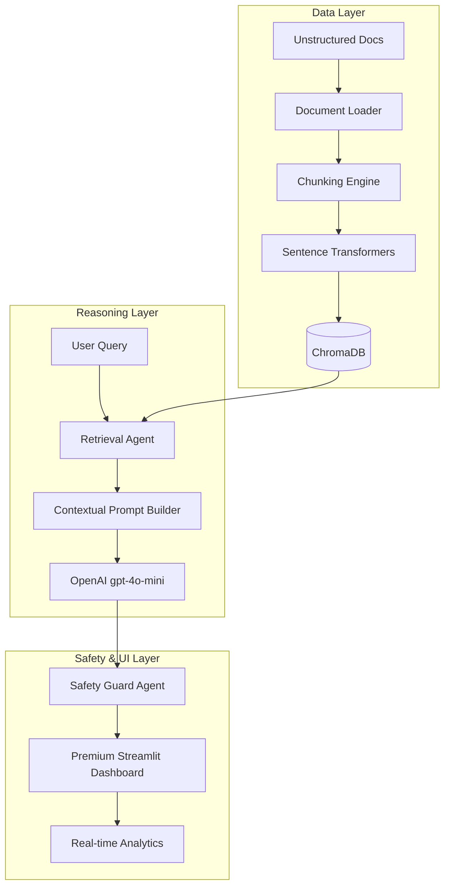

# 🌌 Parsuma AI | Knowledge Intelligence Platform
> **A Master’s Level Multi-Agent RAG System for Intercultural Digital Publishing**

[](https://www.python.org/)
[](https://streamlit.io/)
[](https://openai.com/)
[](https://www.trychroma.com/)
[](https://www.docker.com/)

---

## 📋 Project Overview

**Parsuma AI** is a production-grade Knowledge Intelligence platform engineered as a **Final Project for the Master’s Program in Applied AI Engineering**. 

The platform addresses the complex challenge of **Intercultural Digital Publishing** by providing an intelligent orchestration layer between unstructured institutional knowledge and global content strategy. By leveraging state-of-the-art **Retrieval-Augmented Generation (RAG)**, Parsuma AI enables organizations to transform vast document repositories into actionable, localized, and culturally sensitive publishing roadmaps.

---

## 🌟 Key Features & AI Capabilities

### ⚡ Intelligence & Retrieval
- **Neural Semantic Search**: Utilizes `all-MiniLM-L6-v2` transformers to map documents into a high-dimensional vector space.
- **Dynamic Context Injection**: Intelligently retrieves relevant knowledge chunks to ground LLM responses in factual data.
- **Multi-Format Ingestion**: Native support for PDF, DOCX, and TXT files with sentence-boundary-aware chunking.

### 🤖 Multi-Agent Architecture
The system is built on a decentralized agentic framework:
- **Document Intelligence Agent**: Automates extraction, cleaning, and vectorization of institutional assets.
- **AI Research Chat**: A conversational interface for deep-dive exploration of the knowledge base.
- **Strategy Studio**: Generates intercultural content strategies and localized publishing roadmaps.
- **Safety & Evaluation Agent**: Monitors outputs for grounding, safety, and hallucination risks.

### 🎨 Premium User Experience
- **Futuristic SaaS Interface**: A dark-mode dashboard with glassmorphism aesthetics.
- **Live Telemetry**: Real-time tracking of retrieval confidence, response latency, and token consumption.
- **Responsive Navigation**: 6-page integrated workflow from ingestion to evaluation.

---

## 🏗️ RAG Architecture



---

## 🛠️ Tech Stack

- **Core**: Python 3.10+
- **LLM**: OpenAI GPT-4o-mini / GPT-4
- **Vector Database**: ChromaDB
- **Embeddings**: HuggingFace Sentence-Transformers
- **Frontend**: Streamlit + Custom CSS
- **Visualization**: Plotly
- **DevOps**: Docker, GitHub Actions (Ready)

---

## 🚀 Installation & Setup

### 1. Prerequisites
- Python 3.10 or higher
- An active OpenAI API Key

### 2. Clone the Repository
```bash
git clone https://github.com/animusehsan-sketch/parsuma-ai-platform.git
cd parsuma-ai-platform
```

### 3. Environment Configuration
Create a `.env` file in the root directory:
```bash
# .env
OPENAI_API_KEY=your_actual_key_here
MODEL_NAME=gpt-4o-mini
CHROMA_DB_PATH=./chroma_db
LOG_LEVEL=INFO
```

### 4. Install Dependencies
```bash
pip install -r requirements.txt
```

### 5. Run the Application
```bash
streamlit run app.py
```

---

## 📸 Screenshots
*(Placeholders - Replace with actual images in your repository)*

| Dashboard Overview | AI Research Chat |
| :---: | :---: |
|  |  |

---

## 🔄 Example Workflow

1. **Ingest**: Upload a strategy PDF in the **Knowledge Base**.
2. **Retrieve**: Ask a complex question in **AI Research Chat** (e.g., *"How should we adapt our Nordic strategy for the Persian market?"*).
3. **Analyze**: The system retrieves relevant segments and synthesizes a grounded answer with citations.
4. **Strategize**: Use the **Strategy Studio** to generate a 3-month publishing roadmap based on the retrieved insights.
5. **Evaluate**: Check the **Evaluation** tab to verify the factual grounding score of the response.

---

## 🛡️ Ethical AI & Responsible Development

- **Hallucination Mitigation**: Every response is cross-referenced with retrieved document chunks to ensure mathematical grounding.
- **Data Privacy**: Local vector storage (ChromaDB) ensures that institutional knowledge is indexed privately.
- **Safety Guards**: Integrated detection of adversarial queries and malicious prompt injections.

---

## ⚠️ Limitations & Future Improvements

### Current Limitations
- **File Size**: Optimal performance with documents under 100MB.
- **Language Nuance**: While multi-lingual, extremely rare dialects may require fine-tuned embedding models.

### Future Roadmap
- [ ] **Multi-Modal Support**: Analyzing images and charts within documents.
- [ ] **Advanced Agentic Reasoning**: Implementing ReAct patterns for iterative research tasks.
- [ ] **User Auth**: Integrated SSO for enterprise-grade security.

---

## 👨‍💻 Author

**Ehsan [Last Name]**
*Applied AI Engineering Student*
[LinkedIn](https://www.linkedin.com/) | [GitHub](https://github.com/animusehsan-sketch) | [Portfolio](https://your-portfolio.com)

---
*This project was developed as part of the Master’s in Applied AI Engineering curriculum at Xamk.*
