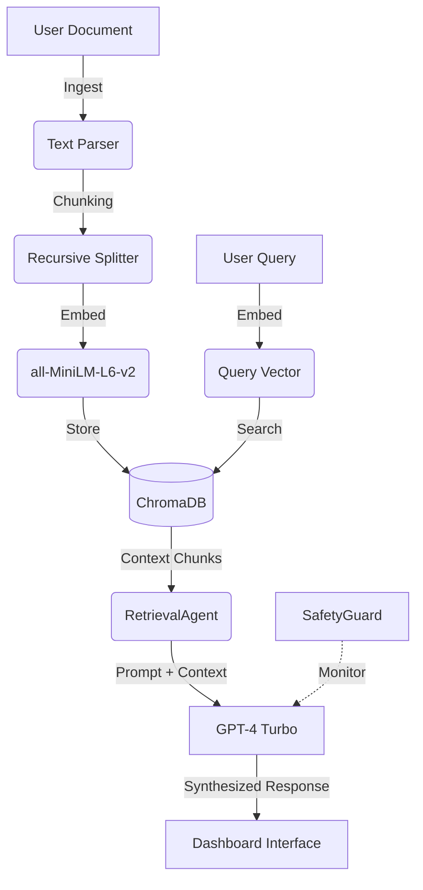

# Technical Architecture: Parsuma AI

## 1. System Overview
Parsuma AI is designed as a modular, agentic Retrieval-Augmented Generation (RAG) platform. Unlike monolithic AI scripts, it decouples the intelligence layers into specialized agents that collaborate to transform institutional documents into actionable content strategy.

## 2. The Neural Pipeline (RAG Flow)
The core of the system follows a 7-stage intelligence lifecycle:

### A. Document Ingestion
- **Formats**: Support for PDF, DOCX, and TXT.
- **Parser**: Specialized libraries (`PyPDF2`, `python-docx`) extract raw text while maintaining logical structure.

### B. Recursive Chunking
- **Strategy**: Text is split using a `RecursiveCharacterTextSplitter`.
- **Parameters**: 500-character chunks with a 50-character overlap ensure semantic context is preserved across chunk boundaries.

### C. Embedding Generation
- **Model**: `all-MiniLM-L6-v2` (via Sentence-Transformers).
- **Output**: 384-dimensional dense vectors representing the semantic essence of each text chunk.

### D. Vector Persistence (ChromaDB)
- **Engine**: ChromaDB serves as the primary vector database.
- **Function**: Indexes the embeddings and provides efficient $O(log N)$ similarity search capabilities.

### E. Semantic Retrieval
- **Agent**: `RetrievalAgent` coordinates with the vector store.
- **Process**: Converts user queries into embeddings and retrieves the top-K most similar chunks using cosine similarity.

### F. LLM Orchestration & Synthesis
- **Model**: GPT-4 Turbo.
- **Synthesis**: The LLM receives the user query alongside the "ground truth" retrieved context. It is instructed to reason only within the bounds of this context.

### G. Visual Interface (Streamlit)
- **Output**: Renders synthesized answers, confidence scores, and source citations to the user.

## 3. Agentic Framework
The system utilizes a "Federated Agent" model:

1. **DocumentIntelligenceAgent**: Manages the ingestion and neural mapping of new assets.
2. **RetrievalAgent**: Bridges the gap between user intent and the vector database.
3. **ContentStrategyAgent**: A specialized synthesis agent that focuses on creative content roadmaps and localization.
4. **SafetyGuard (Agent)**: Monitors the pipeline for hallucinations and ensures all responses are grounded.

## 4. Data Flow Diagram

## 5. Deployment Architecture
- **Environment**: Streamlit Cloud.
- **CI/CD**: Automatic deployment triggered by GitHub commits.
- **Secrets**: API keys managed via `secrets.toml` or Streamlit Secrets Manager.
- **Dependencies**: Managed via a production-ready `requirements.txt`.

---
**Architect**: Ehsan Khosravi  
**Version**: 1.0.0 (Master's Capstone)
