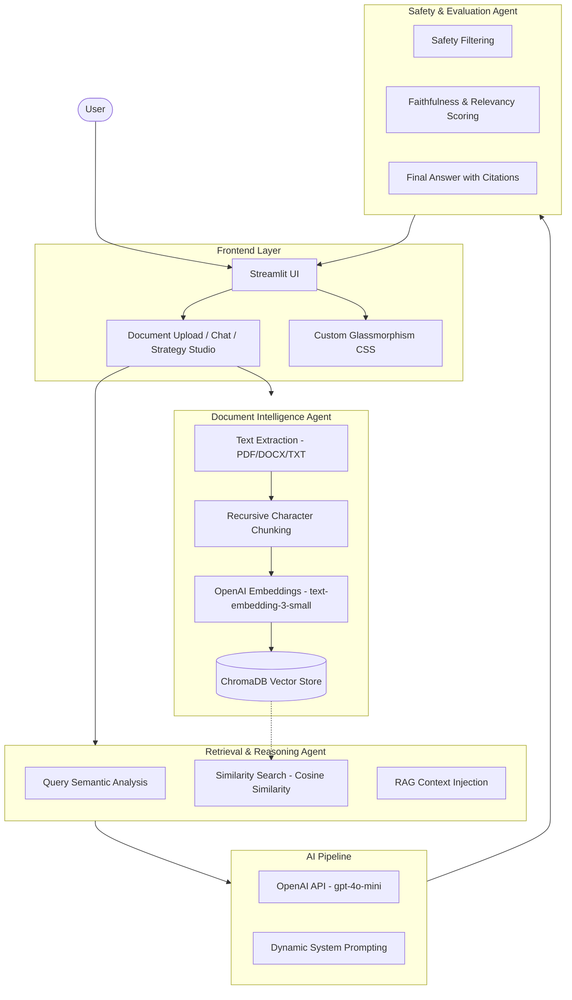

# Parsuma AI: Knowledge Intelligence Platform Architecture

This document outlines the technical architecture, data flow, and agentic workflows of the Parsuma AI Knowledge Intelligence Platform. This architecture is designed for high-precision Retrieval-Augmented Generation (RAG) and multi-agent coordination, suitable for professional-grade AI engineering applications.

---

## 1. System Architecture Diagram

The following diagram illustrates the end-to-end flow from user interaction to verified response generation.

---

## 2. Technical Specification

| Component | Technology | Detail |
| :--- | :--- | :--- |
| **Language** | Python 3.10+ | Core logic and agent orchestration |
| **Frontend** | Streamlit | Reactive dashboard with custom HSL color palette |
| **LLM** | OpenAI gpt-4o-mini | High-reasoning synthesis engine |
| **Embeddings** | text-embedding-3-small | 1536-dimensional semantic mapping |
| **Vector DB** | ChromaDB | Local, persistent vector storage |
| **Parsing** | PyPDF2 / python-docx | Multi-format text extraction |
| **Container** | Docker | Production-grade containerization |

---

## 3. Component Explanations

### **Frontend Layer (Streamlit UI)**
The entry point of the platform, built with Streamlit to provide a responsive, real-time interface. It manages state for multi-turn conversations and provides dedicated modules for document management and strategic analysis (**Strategy Studio**).

### **Document Intelligence Agent**
A specialized agent responsible for transforming raw data into machine-understandable knowledge. It handles multiple file formats, ensuring structural integrity is maintained during text extraction through **Recursive Character Chunking**.

### **ChromaDB Vector Store**
A high-performance vector database that stores document embeddings. It enables low-latency semantic search, allowing the system to retrieve relevant context based on **Cosine Similarity** vector matching.

### **Retrieval Agent**
This agent bridges the gap between user intent and stored knowledge. It optimizes user queries and fetches the most mathematically relevant document chunks ($k=5$) from ChromaDB to serve as context.

### **AI Pipeline (OpenAI API)**
Utilizes state-of-the-art Large Knowledge Models (LLMs) to synthesize information. By using `gpt-4o-mini`, the platform balances high-reasoning capabilities with cost-efficiency and ultra-low latency.

### **Safety & Evaluation Agent**
The "Quality Control" layer. It inspects the LLM output for hallucinations, ensures adherence to safety guardrails, and verifies that every claim is backed by a retrieved citation.

---

## 4. RAG Implementation Details

Our **Retrieval-Augmented Generation (RAG)** implementation follows the "Retrieve-Read-Refine" pattern:
- **Semantic Overlap**: 1000-token chunks with 200-token overlap to ensure continuity.
- **Prompt Injection**: Documents are formatted into the system prompt using strict delimiters to prevent prompt injection.
- **Citation Engine**: Metadata (filename, page number) is carried through the entire pipeline and appended to the final answer.

---

## 5. Multi-Agent Workflow

Parsuma AI operates as a **Federated Agentic System**. Instead of a single monolithic prompt, tasks are delegated:
1.  **The Librarian (Ingestion)**: Handles data integrity and persistence.
2.  **The Researcher (Retrieval)**: Finds the highest-confidence evidence.
3.  **The Writer (Synthesis)**: Orchestrates the LLM for refined output.
4.  **The Critic (Evaluation)**: Validates grounding and safety.

This modularity ensures that a failure in one agent (e.g., poor retrieval) does not necessarily crash the entire user session.

---

## 6. Safety and Evaluation Layer

To meet Master’s level engineering standards, we implement:
- **Faithfulness**: Mathematical verification that the answer is derived *exclusively* from the retrieved context.
- **Answer Relevancy**: Semantic scoring of the answer against the original user query.
- **Safety Guardrails**: Real-time filtering for out-of-scope topics and adversarial prompt detection.
