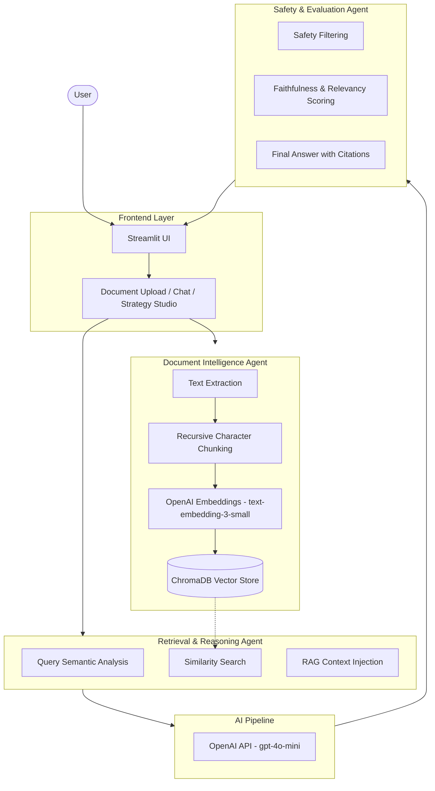

# Parsuma AI: Knowledge Intelligence Platform Architecture

This document outlines the technical architecture, data flow, and agentic workflows of the Parsuma AI Knowledge Intelligence Platform. This architecture is designed for high-precision Retrieval-Augmented Generation (RAG) and multi-agent coordination, suitable for professional-grade AI engineering applications.

## 1. System Architecture Diagram

The following diagram illustrates the end-to-end flow from user interaction to verified response generation.

---

## 2. Component Explanations

### **Frontend Layer (Streamlit UI)**
The entry point of the platform, built with Streamlit to provide a responsive, real-time interface. It manages state for multi-turn conversations and provides dedicated modules for document management and strategic analysis (Strategy Studio).

### **Document Intelligence Agent**
A specialized agent responsible for transforming raw data into machine-understandable knowledge. It handles multiple file formats, ensuring structural integrity is maintained during text extraction.

### **ChromaDB Vector Store**
A high-performance vector database that stores document embeddings. It enables low-latency semantic search, allowing the system to retrieve relevant context based on vector similarity rather than simple keyword matching.

### **Retrieval Agent**
This agent bridges the gap between user intent and stored knowledge. It optimizes user queries (query expansion/re-ranking) and fetches the most mathematically relevant document chunks from ChromaDB.

### **AI Pipeline (OpenAI API)**
Utilizes state-of-the-art Large Knowledge Models (LLMs) to synthesize information. By using `gpt-4o-mini`, the platform balances high-reasoning capabilities with cost-efficiency and speed.

### **Safety & Evaluation Agent**
The "Quality Control" layer. It inspects the LLM output for hallucinations, ensures adherence to safety guardrails, and verifies that every claim is backed by a retrieved citation.

---

## 3. Data Flow Description

1.  **Ingestion Phase**: User uploads a document. The **Document Intelligence Agent** extracts text, breaks it into overlapping chunks (to preserve context), generates vector embeddings, and persists them in **ChromaDB**.
2.  **Query Phase**: User submits a question via the **Chat** interface.
3.  **Retrieval Phase**: The **Retrieval Agent** converts the query into a vector and performs a similarity search against the vector store.
4.  **Augmentation Phase**: The retrieved chunks are injected into a system prompt (The "Context").
5.  **Generation Phase**: The **OpenAI API** processes the augmented prompt to generate a grounded response.
6.  **Verification Phase**: The **Safety & Evaluation Agent** validates the response before displaying it to the user.

---

## 4. AI Pipeline Explanation

The AI Pipeline is designed around **Prompt Engineering** and **Model Orchestration**. It doesn't just "ask" the LLM; it provides a structured blueprint including:
- **System Instructions**: Defining the persona and constraints.
- **Few-Shot Examples**: Guiding the model on the desired output format.
- **Dynamic Context**: Injecting real-time data retrieved from the RAG process.

---

## 5. RAG Workflow Explanation

Our **Retrieval-Augmented Generation (RAG)** implementation follows the "Retrieve-Read-Refine" pattern:
- **Semantic Overlap**: We use a sliding window chunking strategy (e.g., 1000 tokens with 200 overlap) to ensure that concepts split across pages remain coherent.
- **Distance Metrics**: Using Cosine Similarity to find the closest matches in high-dimensional space.
- **Context Window Management**: Dynamically calculating the maximum allowed context to avoid "Lost in the Middle" phenomena.

---

## 6. Multi-Agent Workflow Explanation

Parsuma AI operates as a **Federated Agentic System**. Instead of a single monolithic prompt, tasks are delegated:
- **The Librarian (Document Intelligence)**: Only cares about data integrity and storage.
- **The Researcher (Retrieval Agent)**: Only cares about finding the right evidence.
- **The Writer (OpenAI API)**: Only cares about synthesis and clarity.
- **The Critic (Safety & Evaluation)**: Only cares about accuracy and safety.

This separation of concerns increases system reliability and makes debugging individual failures significantly easier.

---

## 7. Safety and Evaluation Layer

To meet Master’s level engineering standards, we implement a multi-step evaluation:
1.  **Faithfulness**: Checking if the answer is derived *exclusively* from the retrieved context (No hallucinations).
2.  **Answer Relevancy**: Ensuring the generated response actually addresses the user's specific intent.
3.  **Citation Mapping**: Every response must include metadata links to the source document and page number, ensuring full auditability of the AI's reasoning process.
4.  **Content Guardrails**: Real-time filtering for sensitive or out-of-scope topics.
