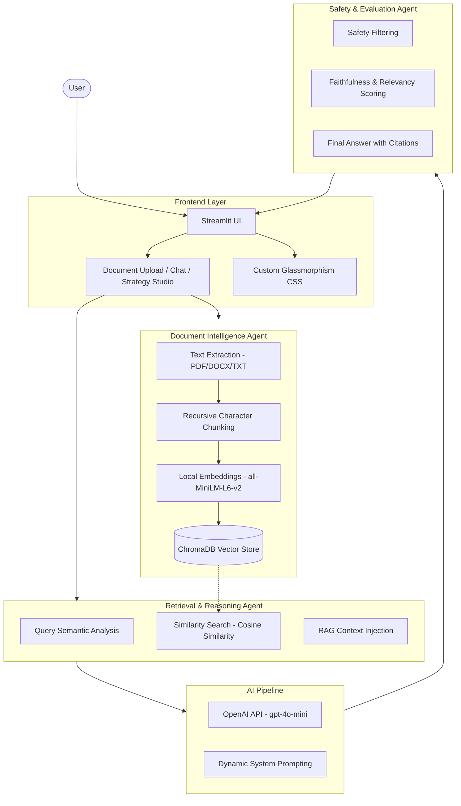

# Parsuma AI: Architecture Overview

This document provides a detailed technical overview of the Parsuma AI Knowledge Intelligence Platform. It covers the system's structural components, the multi-agent orchestration layer, and the data processing pipeline.

---

## 1. System Architecture Diagram

The end-to-end flow from user interaction to verified response generation is illustrated below:

---

## 2. Core Architectural Pillars

### **Federated Agentic Framework**
Unlike standard RAG implementations, Parsuma AI utilizes a **Multi-Agent Orchestration Layer**. This design allows for specialized "Expert Agents" to handle specific domains of the pipeline (Retrieval, Synthesis, Safety), improving overall system reliability and maintainability.

### **Localized Vector Intelligence**
By utilizing local embedding models (`all-MiniLM-L6-v2`) and persistent vector stores (`ChromaDB`), the platform ensures high performance and data privacy, critical for institutional and academic environments.

### **Safety-First Synthesis**
Every response is processed through a dedicated **Safety & Evaluation Agent**. This agent performs factual grounding checks to ensure that the LLM does not hallucinate information beyond the provided knowledge base.

---

## 3. Data Flow Pipeline

1.  **Ingestion**: Documents are parsed, chunked using a recursive character strategy, and vectorized.
2.  **Semantic Retrieval**: Queries are converted to high-dimensional vectors and matched against the ChromaDB index using Cosine Similarity.
3.  **Context Augmentation**: The top relevant chunks are injected into a structured system prompt.
4.  **Verification**: The generated response is audited for faithfulness and relevancy before reaching the UI.
